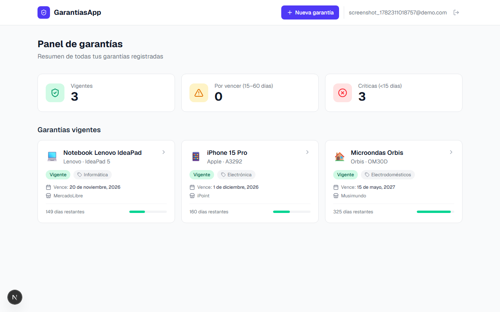
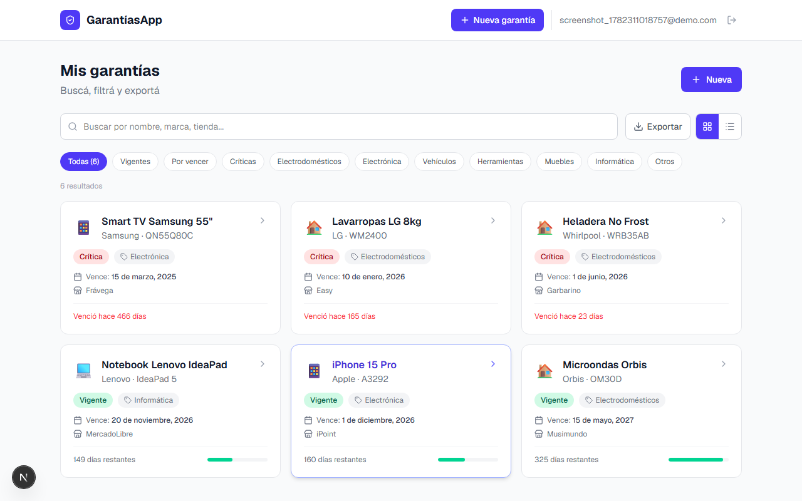
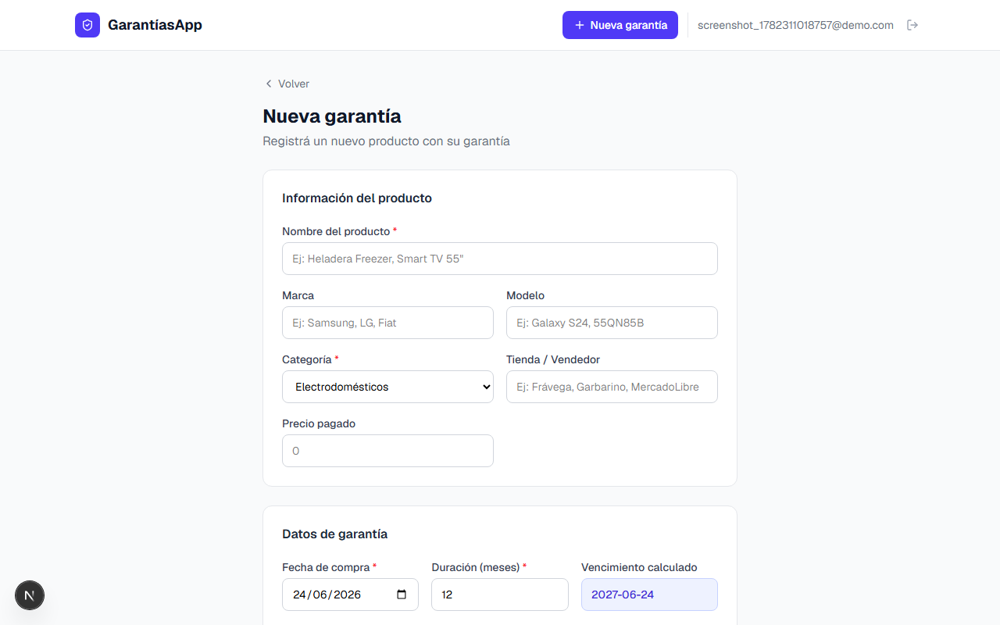
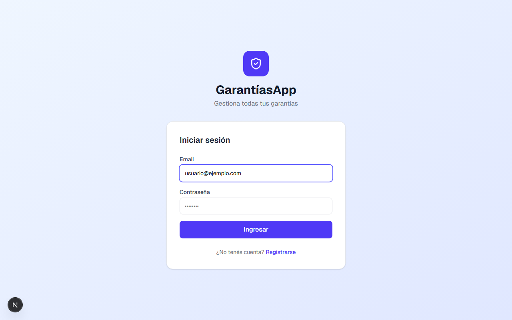
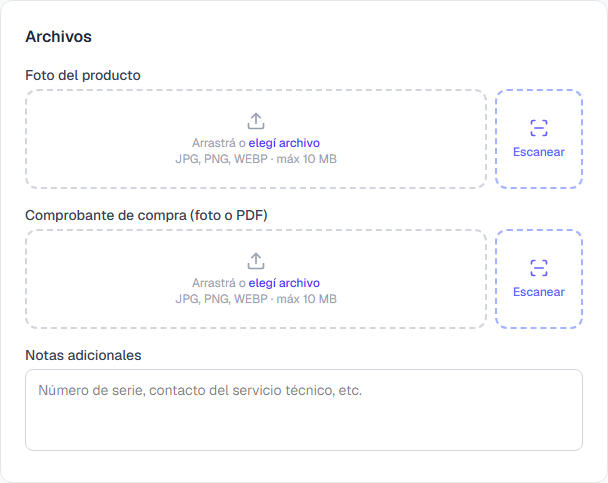

# GarantíasApp

Aplicación web para gestionar garantías de electrodomésticos, electrónica, vehículos y cualquier producto que necesite seguimiento de garantía. Registrá tus productos, recibí alertas antes de que venzan y compartí la información fácilmente.

**[Ver demo en vivo →](https://garantias-l2zdmc80t-lucho-codes-projects.vercel.app)**

---

## Screenshots

| Dashboard | Lista de garantías |
|---|---|
|  |  |

| Nueva garantía | Inicio de sesión |
|---|---|
|  |  |

| Escáner de documentos |
|---|
|  |

---

## Características

- **Gestión completa** — Creá, editá y eliminá garantías con todos los detalles del producto
- **Dashboard inteligente** — Visualizá de un vistazo cuántas garantías están vigentes, por vencer o vencidas
- **Búsqueda y filtros en tiempo real** — Filtrá por categoría, estado o buscá por nombre, marca o tienda
- **Vista grilla / lista** — Elegí cómo visualizar tus garantías
- **Upload de archivos** — Adjuntá foto del producto y comprobante de compra (JPG, PNG, PDF) con drag & drop
- **Escáner de documentos** — Capturá comprobantes directamente con la cámara del dispositivo. Modo B&N para efecto de documento escaneado, flip de cámara frontal/trasera y guía de encuadre
- **Exportar** — Descargá todas tus garantías en PDF o Excel con un clic
- **Compartir** — Generá un link público para compartir los detalles de una garantía sin necesidad de cuenta
- **Notificaciones por email** — Recibí un resumen diario automático de las garantías próximas a vencer
- **Autenticación segura** — Registro e inicio de sesión con Supabase Auth
- **Datos aislados** — Row Level Security garantiza que cada usuario solo accede a sus propios datos

## Categorías soportadas

Electrodomésticos · Electrónica · Vehículos · Herramientas · Muebles · Informática · Otros

---

## Stack tecnológico

| Tecnología | Uso |
|---|---|
| [Next.js 16](https://nextjs.org) | Framework fullstack con App Router |
| [Supabase](https://supabase.com) | Base de datos PostgreSQL, autenticación y storage |
| [Tailwind CSS 4](https://tailwindcss.com) | Estilos |
| [Resend](https://resend.com) | Envío de emails transaccionales |
| [jsPDF](https://github.com/parallax/jsPDF) | Exportación a PDF |
| [SheetJS (xlsx)](https://sheetjs.com) | Exportación a Excel |
| [Lucide React](https://lucide.dev) | Iconos |
| [date-fns](https://date-fns.org) | Manejo de fechas |
| [Vercel](https://vercel.com) | Deploy y cron jobs |

---

## Estructura del proyecto

```
garantias-app/
├── app/
│   ├── api/notificaciones/     # API endpoint para el cron de emails
│   ├── dashboard/              # Panel principal con estadísticas
│   ├── garantias/
│   │   ├── [id]/               # Detalle de garantía
│   │   │   └── editar/         # Edición de garantía
│   │   └── nueva/              # Creación de garantía
│   ├── login/                  # Inicio de sesión
│   ├── register/               # Registro de cuenta
│   └── share/[token]/          # Página pública de garantía compartida
├── components/
│   ├── ExportButton.tsx        # Exportación PDF / Excel
│   ├── FileUpload.tsx          # Upload con drag & drop
│   ├── Navbar.tsx              # Barra de navegación
│   ├── ShareButton.tsx         # Compartir con link público
│   ├── WarrantiesList.tsx      # Lista con búsqueda y filtros en tiempo real
│   ├── WarrantyCard.tsx        # Tarjeta de garantía (vista grilla)
│   ├── WarrantyForm.tsx        # Formulario crear / editar
│   └── WarrantyRow.tsx         # Fila de garantía (vista lista)
├── lib/
│   ├── supabase/
│   │   ├── client.ts           # Cliente Supabase para el browser
│   │   └── server.ts           # Cliente Supabase para el servidor
│   └── utils.ts                # Helpers de fechas, moneda y estilos
├── supabase/
│   └── migration.sql           # Migración inicial de la base de datos
├── types/
│   └── warranty.ts             # Tipos TypeScript y helpers de estado
├── proxy.ts                    # Middleware de autenticación (Next.js 16)
└── vercel.json                 # Configuración del cron job
```

---

## Primeros pasos

### Requisitos

- Node.js 18+
- Cuenta en [Supabase](https://supabase.com)
- Cuenta en [Resend](https://resend.com) (opcional, para emails)

### Instalación

```bash
# 1. Clonar el repositorio
git clone https://github.com/Lucho-code/garantias-app.git
cd garantias-app

# 2. Instalar dependencias
npm install

# 3. Configurar variables de entorno
cp .env.local.example .env.local
```

Editá `.env.local` con tus credenciales:

```env
NEXT_PUBLIC_SUPABASE_URL=https://tu-proyecto.supabase.co
NEXT_PUBLIC_SUPABASE_ANON_KEY=tu-anon-key

# Opcionales — para notificaciones por email
RESEND_API_KEY=re_xxxxxxxxxxxx
CRON_SECRET=un-string-secreto-largo
NEXT_PUBLIC_APP_URL=http://localhost:3000
```

### Base de datos

Ejecutá el contenido de `supabase/migration.sql` en el **SQL Editor** de tu proyecto Supabase. Esto crea:

- Tabla `warranties` con todos los campos necesarios
- Políticas de Row Level Security
- Trigger para `updated_at` automático
- Bucket de Storage para archivos adjuntos

### Correr en desarrollo

```bash
npm run dev
```

Abrí [http://localhost:3000](http://localhost:3000).

---

## Variables de entorno

| Variable | Requerida | Descripción |
|---|---|---|
| `NEXT_PUBLIC_SUPABASE_URL` | Sí | URL de tu proyecto Supabase |
| `NEXT_PUBLIC_SUPABASE_ANON_KEY` | Sí | Clave pública de Supabase |
| `RESEND_API_KEY` | No | API key de Resend para emails |
| `CRON_SECRET` | No | Token para proteger el endpoint del cron |
| `NEXT_PUBLIC_APP_URL` | No | URL pública de la app (para links en emails) |

---

## Notificaciones por email

El endpoint `GET /api/notificaciones` es invocado automáticamente todos los días a las **9:00 AM** mediante un cron job de Vercel (configurado en `vercel.json`).

El email incluye:
- Lista de garantías que vencen en los próximos **7 días** (marcadas como urgentes)
- Lista de garantías que vencen en los próximos **30 días**
- Link directo a la app

Para activarlo localmente podés llamar al endpoint directamente:

```bash
curl -H "Authorization: Bearer tu-cron-secret" http://localhost:3000/api/notificaciones
```

---

## Deploy

El proyecto está preconfigurado para Vercel. Cualquier push a `master` dispara un deploy automático.

```bash
# Deploy manual
npx vercel --prod
```

Recordá agregar las variables de entorno en el dashboard de Vercel antes del primer deploy.

---

## Licencia

MIT
